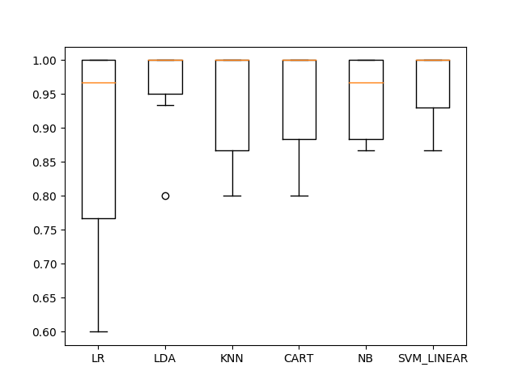
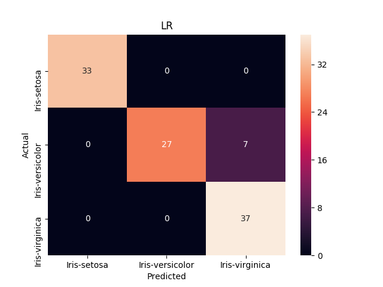
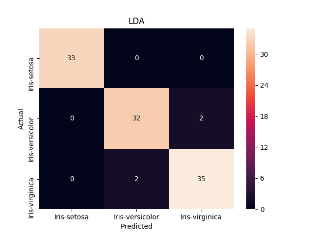
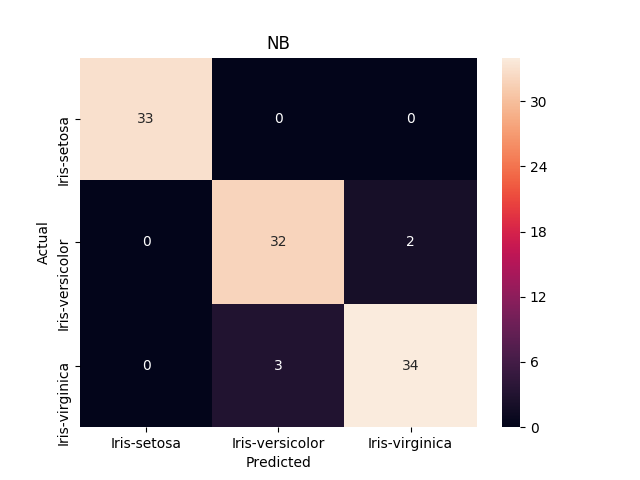
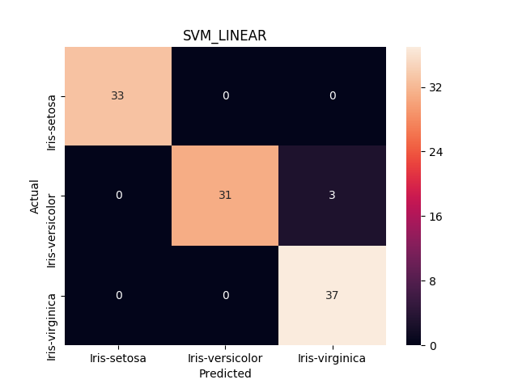

# evaluate_classification_model

Evaluating a classification model with ml parameters

#### Input data

Implemented to read the `.npy` files. Like shown below,

- `input_data.npy`
- `target_data.npy`


#### What it will do ?

- k-fold cross validation
- Multiple classifiers comparison
- Confusion matrix testing
- Model accuracy
- Rank_1 accuracy  

#### Command

```commandline
python eval_classifier.py --classifier-path /path/to/save_dir --input-data /path/to/input.npy --target-data /path/to/target.npy
```

#### Output:

##### Comparison:



##### Confusion Matrices:

|||
|----------------------------------|--------------------------------|
|||
|||
|||